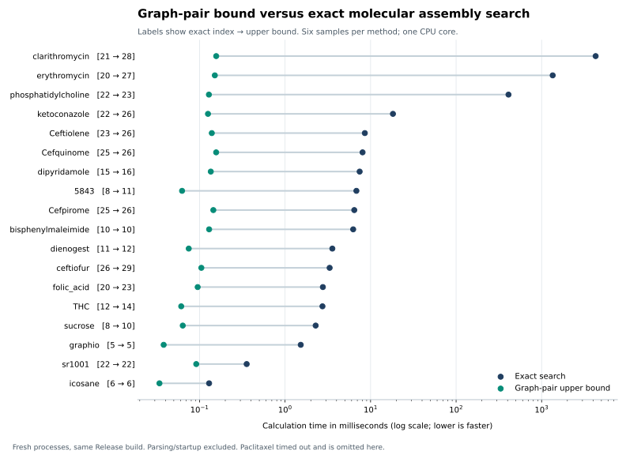

# Graph-pair upper bound versus exact search: timing comparison

This experiment compares bound-only with exact search. See
[the historical seed comparison](SEED.md) for an exact-search seeding experiment
that was subsequently removed; full mode again uses the unseeded exact solver.

On the 34 benchmark cases where exact search completed, computing the graph-pair
upper bound was **47.4× faster for the median case in calculation time**, and
**4.18× faster end to end**. All 37 graph-bound calculations completed; three
exact calculations exceeded the 10-second deadline. These compare the time to
obtain a constructive upper bound with the time to prove the minimum.

## Representative molecules

Times are medians of six measurements, in milliseconds. Calculation time excludes
parsing, process startup, result serialization and process teardown. Speedups are
medians of paired ratios, so rounding and pairing can differ from dividing the
displayed median times.

| Molecule | Exact calculation (ms) | Graph bound (ms) | Calculation speedup | End-to-end speedup | Exact index → bound |
| --- | ---: | ---: | ---: | ---: | ---: |
| icosane | 0.129 | 0.034 | 3.8× | 1.06× | 6 → 6 |
| ketoconazole | 18.259 | 0.126 | 145.2× | 10.05× | 22 → 26 |
| sucrose | 2.280 | 0.064 | 36.0× | 2.20× | 8 → 10 |
| phosphatidylcholine | 409.841 | 0.129 | 3,198.3× | 197.13× | 22 → 23 |
| erythromycin | 1347.114 | 0.151 | 8,935.7× | 626.45× | 20 → 27 |
| clarithromycin | 4283.122 | 0.157 | 27,304.9× | 1,938.71× | 21 → 28 |



## Aggregate and quality

For one representative calculation of each of the 34 completed cases, summing
per-case median calculation times gives **13.566 seconds for exact search versus
3.856 milliseconds for graph bounds**, a 3,519× ratio. The corresponding sums
of end-to-end times are 13.640 seconds versus 67.648 milliseconds (202×).
These aggregate ratios are dominated by the hardest exact cases; the 47.4×
and 4.18× median-case figures above describe a typical case in this manifest.

All 34 completed exact calculations matched their manifest references, with no
runtime or enumeration limit triggered. Graph bounds equalled the exact index
in **14 of 34 cases**. Their mean excess was **1.56 joins**, with maximum seven.
The 37 graph-bound per-case median calculation times ranged from 34 to 283 µs,
with a median of 123 µs. This cold-process, named-benchmark corpus differs from
earlier 25 µs measurements over the larger batch corpus, where canonicalization
interners were reused across molecules within each pass.

## Unfinished exact cases

Each of these exact searches timed out during its warmup and was not repeated.
Only the graph method then has measured repetitions. Their exact calculation
times and exact indices were not determined by this run. Timeout lower bounds
apply exclusively to end-to-end process time; they are excluded from all
completed-case aggregates.

| Case | Exact process | Graph process (ms) | Graph calculation (ms) | End-to-end speedup lower bound | Graph upper bound |
| --- | ---: | ---: | ---: | ---: | ---: |
| paclitaxel | >10 s | 2.075 | 0.283 | >4,820× | 30 |
| amino-acid-scale-12c | >10 s | 2.061 | 0.209 | >4,853× | 36 |
| amino-acid-scale-13c | >10 s | 2.036 | 0.219 | >4,913× | 38 |

## All completed cases

| Case | Exact calculation (ms) | Graph calculation (ms) | Paired calculation speedup | Paired end-to-end speedup | Exact → bound |
| --- | ---: | ---: | ---: | ---: | ---: |
| icosane | 0.129 | 0.034 | 3.8× | 1.06× | 6 → 6 |
| sr1001 | 0.356 | 0.092 | 3.9× | 1.14× | 22 → 22 |
| 5843 | 6.826 | 0.062 | 110.3× | 4.67× | 8 → 11 |
| bisphenylmaleimide | 6.260 | 0.129 | 48.1× | 4.19× | 10 → 10 |
| ketoconazole | 18.259 | 0.126 | 145.2× | 10.05× | 22 → 26 |
| THC | 2.738 | 0.061 | 44.7× | 2.42× | 12 → 14 |
| sucrose | 2.280 | 0.064 | 36.0× | 2.20× | 8 → 10 |
| graphio | 1.526 | 0.038 | 39.8× | 1.84× | 5 → 5 |
| Ceftiolene | 8.565 | 0.139 | 61.6× | 5.17× | 23 → 26 |
| Cefquinome | 8.060 | 0.156 | 47.2× | 4.35× | 25 → 26 |
| Cefpirome | 6.447 | 0.145 | 44.8× | 4.17× | 25 → 26 |
| dipyridamole | 7.451 | 0.135 | 55.3× | 4.60× | 15 → 16 |
| ceftiofur | 3.321 | 0.105 | 31.9× | 2.62× | 26 → 29 |
| dienogest | 3.572 | 0.075 | 47.7× | 2.79× | 11 → 12 |
| folic_acid | 2.768 | 0.095 | 29.1× | 2.40× | 20 → 23 |
| phosphatidylcholine | 409.841 | 0.129 | 3,198.3× | 197.13× | 22 → 23 |
| erythromycin | 1347.114 | 0.151 | 8,935.7× | 626.45× | 20 → 27 |
| clarithromycin | 4283.122 | 0.157 | 27,304.9× | 1,938.71× | 21 → 28 |
| amino-acid-scale-02c | 0.083 | 0.037 | 2.3× | 1.05× | 10 → 10 |
| amino-acid-scale-03c | 0.220 | 0.051 | 4.3× | 1.11× | 13 → 13 |
| amino-acid-scale-04c | 0.700 | 0.061 | 11.6× | 1.39× | 15 → 15 |
| amino-acid-scale-05c | 0.841 | 0.072 | 12.1× | 1.44× | 17 → 17 |
| amino-acid-scale-06c | 3.216 | 0.096 | 33.6× | 2.66× | 19 → 19 |
| amino-acid-scale-07c | 14.365 | 0.123 | 116.0× | 8.13× | 21 → 24 |
| amino-acid-scale-08c | 46.987 | 0.121 | 389.0× | 24.24× | 23 → 23 |
| amino-acid-scale-09c | 280.252 | 0.139 | 2,013.9× | 133.46× | 25 → 26 |
| amino-acid-scale-10c | 1257.918 | 0.172 | 7,288.6× | 574.34× | 27 → 29 |
| amino-acid-scale-11c | 5716.341 | 0.195 | 29,354.3× | 2,600.41× | 29 → 33 |
| mask-boundary-path-063b | 2.690 | 0.088 | 30.7× | 2.43× | 8 → 10 |
| mask-boundary-path-064b | 2.594 | 0.094 | 27.8× | 2.35× | 6 → 6 |
| mask-boundary-path-065b | 3.170 | 0.100 | 31.6× | 2.63× | 7 → 7 |
| mask-boundary-path-127b | 58.970 | 0.199 | 295.4× | 28.59× | 10 → 12 |
| mask-boundary-path-128b | 28.940 | 0.203 | 142.1× | 14.65× | 7 → 7 |
| mask-boundary-path-129b | 30.079 | 0.212 | 141.9× | 15.19× | 8 → 8 |

## Method and reproduction

- Same serial executable for both methods, GCC 15.2.0, portable Release build
  (`-O3 -DNDEBUG`), no OpenMP, MPI or telemetry instrumentation in the probe.
- Intel Core i7-14700KF, both methods pinned to CPU 0.
- All 37 entries in `benchmarks/cases.tsv`; six measured pairs after one warmup
  per method and case; exact/bound order alternates.
- Every sample starts a fresh process, preventing reuse of canonicalization
  interners between exact and heuristic calls or between molecules.
- Both modes remove explicit hydrogens, disable pathway output and use the
  default disconnected-component convention. Exact enumeration cap: 50 million.
- Calculation wall time uses `steady_clock` after identical input parsing.
  CPU time is retained separately. End-to-end time also includes subprocess
  startup, parsing, JSON output, teardown and Python subprocess overhead.
- Every completed exact value is checked against the reviewed references;
  provisional references are recorded separately. Heuristic values are checked
  against the exact result and the trivial bond-count bound.
- The runner excludes any case with an incomplete exact sample from completed
  speedup statistics. Nine focused timing-runner tests pass, including timeout
  handling and paired-median aggregation. Independent recomputation of the final
  statistics and result comparisons also passed.

```bash
cmake -S . -B build/graph-repair -G Ninja \
  -DCMAKE_BUILD_TYPE=Release -DBUILD_TESTING=ON
cmake --build build/graph-repair --target parallelassemblycpp_graph_repair_speed_probe
python benchmarks/graph_repair_speed.py \
  --probe build/graph-repair/parallelassemblycpp_graph_repair_speed_probe \
  --cpu 0 --timeout 10 --runs 6 --warmup 1 \
  --json-output audits/2026-09-29-graph-repair/speed.json \
  --csv-output audits/2026-09-29-graph-repair/speed.csv
python audits/2026-09-29-graph-repair/plot_speed.py
```

Choose an allowed CPU for `--cpu` on another machine. Raw events, all samples,
input/source/executable fingerprints and run settings are in [speed.json](speed.json);
[speed.csv](speed.csv) contains the sample rows. The [chart](speed.svg) is also
available as SVG.

The graph-pair option remains a bound-only calculation. This experiment does not
measure using it to seed the exact solver. The Python trail-RePair baseline was
not used for runtime comparisons because implementation-language differences
would confound that comparison. See [the quality comparison](REPORT.md) for
graph-versus-trail bound quality.
